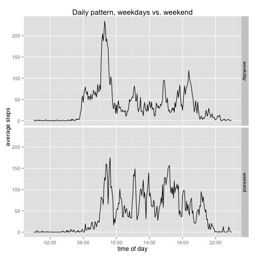

## Preparing the environment


```r
library(dplyr)
library(ggplot2)
Sys.setlocale("LC_TIME", "en_US.UTF-8")
```

## Loading and preprocessing the data


```r
if(!file.exists("activity.zip")) {
      fileUrl <-"https://d396qusza40orc.cloudfront.net/repdata%2Fdata%2Factivity.zip"
      download.file(fileUrl, "activity.zip", method = "curl")
} 
filename = "activity.csv"

if(!file.exists(filename)) unzip("activity.zip")

activity <- read.csv(filename, header = TRUE, sep = ',', quote = '\"',stringsAsFactors = FALSE)
activity$date <- as.Date(activity$date, "%Y-%m-%d")
d_t <- as.POSIXlt(activity$date)
d_t$hour <- activity$interval %/% 100
d_t$min <- activity$interval %% 100
activity$time <- substr(as.POSIXct(d_t), 12, 16)
activity <- tbl_df(activity)
```

## What is mean total number of steps taken per day?


```r
totalByDate <- activity %>% group_by(date) %>% summarize(total_steps=sum(steps))
with(totalByDate, hist(total_steps, main = 'Total steps per day', xlab = 'steps'))
```

 

The mean of steps per day is **10766**
and the median is **10765**.

## What is the average daily activity pattern?


```r
dailyPattern <- activity %>% group_by(time) %>% summarize(average_steps=mean(steps,na.rm = TRUE))

with(dailyPattern, plot(as.POSIXct(strptime(time, "%H:%M")),
                        average_steps, type = "l", lwd = 3,
                        main = "Daily activity pattern",
                        xlab = "time"))
```

 

Max number of steps per interval for an average day is 
**206**.
This maxinum is achieved at interval **08:35**.


## Imputing missing values

There are 2304 lines with NAs in the dataset.

Replacing these NAs with daily averages for the same time interval. 


```r
corrAct <- activity

corrAct$av_steps <- ave(corrAct$steps, corrAct$time, FUN = function(x) mean(x, na.rm = TRUE))
corrAct$corr_steps <- ifelse(is.na(corrAct$steps), corrAct$av_steps, corrAct$steps) 

corrByDate <- corrAct %>% group_by(date) %>% summarize(total_corr_steps=sum(corr_steps))

with(corrByDate, hist(total_corr_steps,  main = 'Total steps per day, NAs replaced', xlab = 'steps'))
```

 


After replacing NAs with daily averages the mean of steps per day is **10766** and the median is **10766**.

There are no significant differences between these numbers and the pre-correction results.

## Are there differences in activity patterns between weekdays and weekends?


```r
day <- weekdays(corrAct$date)
corrAct$weekend <- as.factor(ifelse(day=='Sunday' | day=='Saturday', 'weekend', 'weekday'))
weekdayPattern <- corrAct %>% group_by(time,weekend) %>% summarize(average_steps=mean(steps,na.rm = TRUE))

plot <- ggplot(data = weekdayPattern, aes(x=strptime(time, "%H:%M"),y=average_steps)) +
      geom_line(stat = "identity", width=0.6, color = "black", fill = "brown") +
      facet_grid(weekend~.) +
      ggtitle("Daily pattern, weekdays vs. weekend") + xlab("time of day") + ylab("average steps") +
      scale_x_datetime(breaks = "4 hour", labels = c('','02:00','06:00','10:00','14:00','18:00','22:00',''))

print(plot)
```

 

